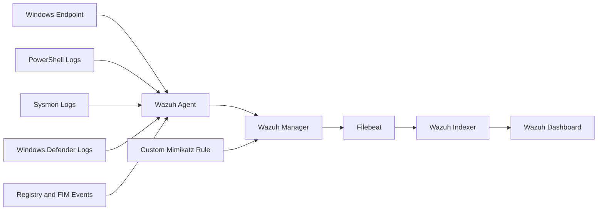
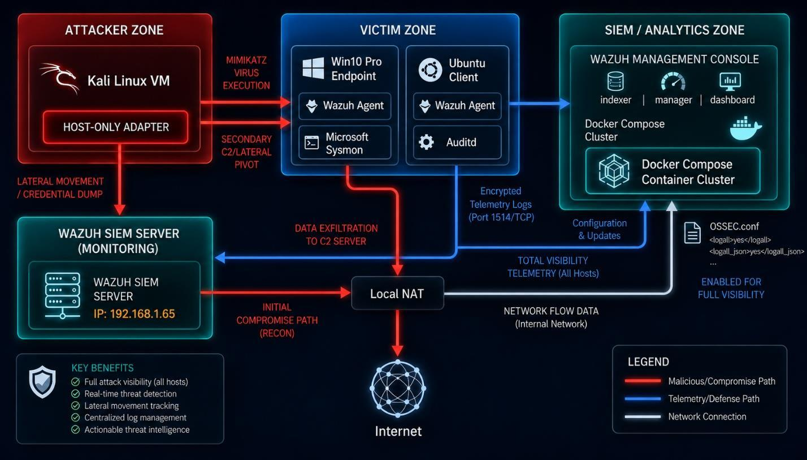
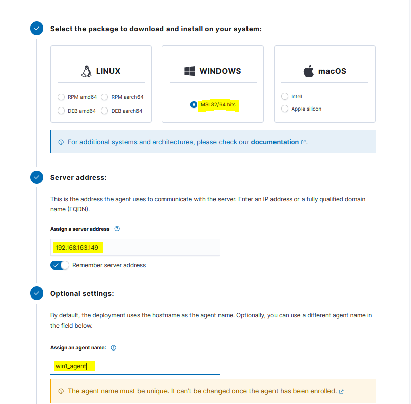
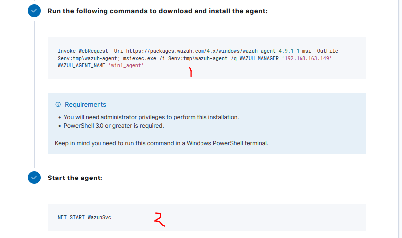
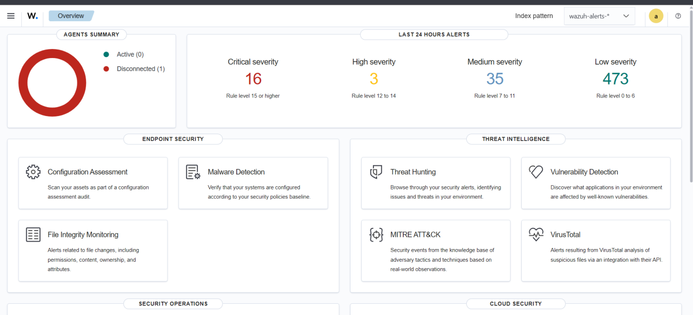
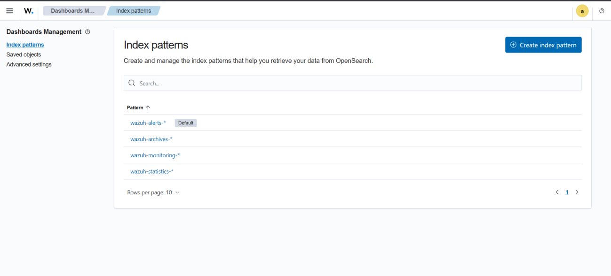
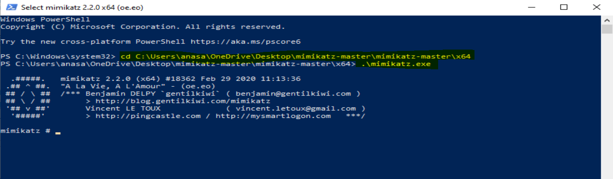
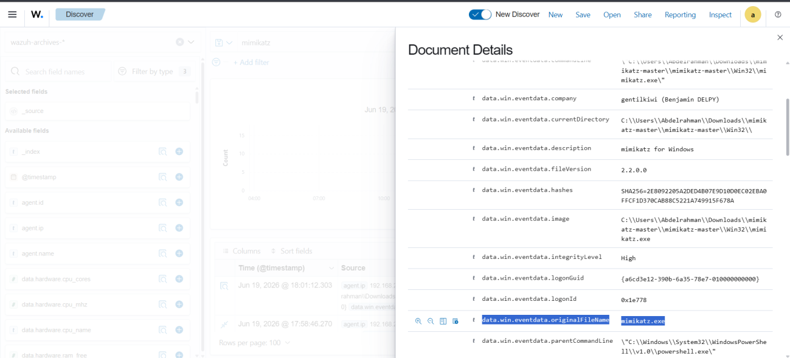
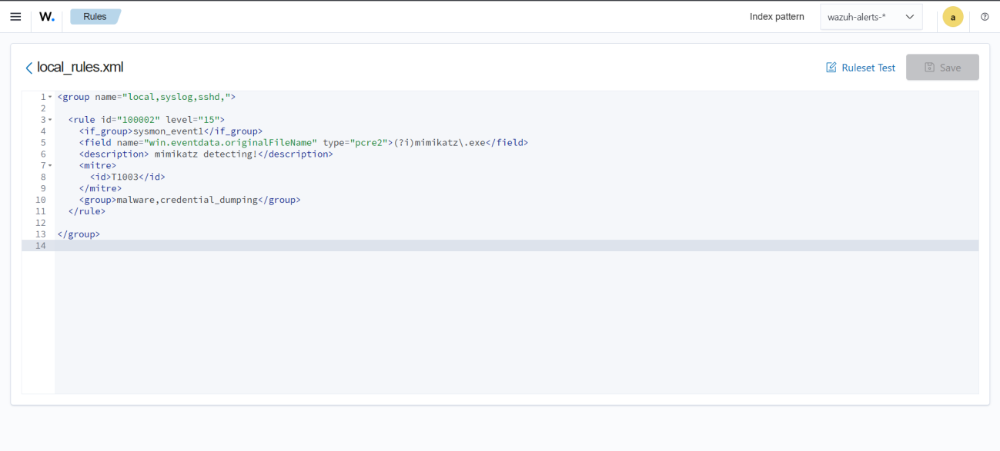

# Wazuh SOC Home Lab

This project documents a SOC-style monitoring lab built with **Wazuh** to collect, analyze, and alert on Windows endpoint activity.

The lab focuses on Windows security monitoring, PowerShell logging, Sysmon telemetry, file integrity monitoring, registry monitoring, and a custom detection rule for **Mimikatz** activity.

> This project was built for learning and defensive security practice only. Tools such as Mimikatz should only be tested in an isolated lab environment that you own and control.

## Overview

The goal of this lab was to configure Wazuh as a central monitoring platform for Windows endpoint activity.

The lab collects logs from multiple Windows event channels, enables PowerShell Script Block Logging, configures Wazuh agent monitoring, tunes Filebeat ingestion, and creates a custom rule to detect Mimikatz-related behavior.

## Lab Objectives

- Configure Wazuh to monitor a Windows endpoint.
- Enable PowerShell Script Block Logging.
- Collect Windows Security, Application, System, Sysmon, Defender, DNS, Firewall, Task Scheduler, WMI, BITS, and AppLocker logs.
- Enable file integrity monitoring for sensitive Windows paths.
- Monitor registry keys commonly abused for persistence.
- Tune Wazuh manager and Filebeat for log ingestion.
- Create a custom Wazuh rule to detect Mimikatz execution.
- Validate that suspicious activity appears in the Wazuh dashboard.

## Tools Used

| Tool | Purpose |
| --- | --- |
| Wazuh | SIEM and endpoint security monitoring platform |
| Wazuh Agent | Collects telemetry from the Windows endpoint |
| Windows Server / Windows Endpoint | Monitored host in the lab |
| Sysmon | Provides detailed Windows process and system telemetry |
| PowerShell Script Block Logging | Captures PowerShell command content for investigation |
| Filebeat | Ships Wazuh alerts and archives into the indexer |
| Mimikatz | Controlled test case for credential-access detection |

## Architecture



## PowerShell Monitoring

PowerShell Script Block Logging was enabled to improve visibility into PowerShell commands executed on the endpoint.

```powershell
reg add "HKLM\Software\Policies\Microsoft\Windows\PowerShell\ScriptBlockLogging" /v EnableScriptBlockLogging /t REG_DWORD /d 1 /f
```

This helps detect suspicious PowerShell usage, encoded commands, payload download attempts, and post-exploitation activity.

## Wazuh Agent Configuration

The Windows agent was configured to connect to the Wazuh manager:

```xml
<client>
  <server>
    <address>192.168.163.149</address>
    <port>1514</port>
    <protocol>tcp</protocol>
  </server>
  <crypto_method>aes</crypto_method>
  <notify_time>10</notify_time>
  <time-reconnect>60</time-reconnect>
  <auto_restart>yes</auto_restart>
</client>
```

The client buffer was enabled to help handle event volume:

```xml
<client_buffer>
  <disabled>no</disabled>
  <queue_size>5000</queue_size>
  <events_per_second>500</events_per_second>
</client_buffer>
```

## Windows Event Collection

The agent was configured to collect key Windows event channels:

| Event Source | Purpose |
| --- | --- |
| Application | Application-level events and errors |
| Security | Authentication, authorization, and audit events |
| System | System service and operating system events |
| Sysmon Operational | Process, network, file, and registry telemetry |
| PowerShell Operational | PowerShell activity monitoring |
| Windows PowerShell | Legacy PowerShell logs |
| Windows Defender Operational | Antivirus and malware detection events |
| DNS Client Operational | DNS query visibility |
| Windows Firewall | Firewall activity |
| Task Scheduler Operational | Scheduled task creation and execution |
| WMI Activity Operational | WMI activity often used in lateral movement and persistence |
| BITS Client Operational | BITS transfer activity |
| AppLocker | Application control events |

Example configuration:

```xml
<localfile>
  <location>Microsoft-Windows-Sysmon/Operational</location>
  <log_format>eventchannel</log_format>
</localfile>

<localfile>
  <location>Microsoft-Windows-PowerShell/Operational</location>
  <log_format>eventchannel</log_format>
</localfile>

<localfile>
  <location>Microsoft-Windows-Windows Defender/Operational</location>
  <log_format>eventchannel</log_format>
</localfile>
```

## File Integrity Monitoring

Wazuh File Integrity Monitoring was enabled to watch sensitive Windows directories and startup locations.

Examples include:

```xml
<syscheck>
  <disabled>no</disabled>
  <frequency>43200</frequency>

  <directories realtime="yes">%PROGRAMDATA%\Microsoft\Windows\Start Menu\Programs\Startup</directories>
  <directories realtime="yes">%APPDATA%\Microsoft\Windows\Start Menu\Programs\Startup</directories>
  <directories realtime="yes" check_all="yes">%WINDIR%\System32\drivers\etc</directories>
  <directories realtime="yes" check_all="yes">%TEMP%</directories>
  <directories realtime="yes" check_all="yes">%WINDIR%\Temp</directories>
</syscheck>
```

This helps detect persistence attempts, hosts file changes, suspicious temporary file activity, and changes in important system paths.

## Registry Monitoring

Registry monitoring was configured for common persistence and security-sensitive locations.

Examples include:

```xml
<windows_registry arch="both">HKEY_LOCAL_MACHINE\Software\Microsoft\Windows\CurrentVersion\Run</windows_registry>
<windows_registry arch="both">HKEY_LOCAL_MACHINE\Software\Microsoft\Windows\CurrentVersion\RunOnce</windows_registry>
<windows_registry arch="both">HKEY_CURRENT_USER\Software\Microsoft\Windows\CurrentVersion\Run</windows_registry>
<windows_registry>HKEY_LOCAL_MACHINE\System\CurrentControlSet\Services</windows_registry>
<windows_registry arch="both">HKEY_LOCAL_MACHINE\Software\Policies\Microsoft\Windows\PowerShell</windows_registry>
<windows_registry arch="both">HKEY_LOCAL_MACHINE\Software\Microsoft\Windows Defender</windows_registry>
```

These keys are useful for detecting persistence, service creation, security policy changes, PowerShell logging changes, and Defender configuration tampering.

## Manager And Filebeat Configuration

On the Wazuh manager, the original configuration was backed up before making changes:

```bash
sudo cp /var/ossec/etc/ossec.conf ~/ossec-backup.conf
sudo nano /var/ossec/etc/ossec.conf
```

The following settings were enabled to preserve and ingest logs:

```xml
<logall>yes</logall>
<logall_json>yes</logall_json>
```

Filebeat was then configured to ingest the generated logs:

```bash
sudo nano /etc/filebeat/filebeat.yml
```

The required Filebeat setting was changed to:

```yaml
enabled: true
```

## Attack Simulation

Mimikatz was used as a controlled test case to validate credential-access detection.

Reference used in the lab:

```text
https://github.com/ParrotSec/mimikatz/archive/refs/heads/master.zip
```

Mimikatz maps to MITRE ATT&CK technique:

| Technique | Description |
| --- | --- |
| `T1003` | OS Credential Dumping |

## Custom Wazuh Detection Rule

A custom Wazuh rule was created to detect Mimikatz execution through Sysmon Event ID 1 process creation telemetry.

```xml
<rule id="100002" level="15">
  <if_group>sysmon_event1</if_group>
  <field name="win.eventdata.originalFileName" type="pcre2">(?i)mimikatz\.exe</field>
  <description>Mimikatz execution detected</description>
  <mitre>
    <id>T1003</id>
  </mitre>
</rule>
```

Rule details:

| Field | Value |
| --- | --- |
| Rule ID | `100002` |
| Severity level | `15` |
| Data source | Sysmon Event ID 1 |
| Detection field | `win.eventdata.originalFileName` |
| MITRE ATT&CK | `T1003 - OS Credential Dumping` |

## Screenshots

### Lab Overview




### Wazuh Configuration





### Manager And Filebeat



### Mimikatz Detection









## Results

The lab successfully configured Wazuh to monitor a Windows endpoint across multiple security-relevant event sources.

The custom Mimikatz rule provides a high-severity alert for credential-access behavior, while the broader agent configuration improves visibility into PowerShell, Sysmon, Defender, DNS, Firewall, WMI, BITS, AppLocker, file integrity, and registry activity.

## Key Takeaways

- Wazuh can provide strong endpoint visibility when Windows event channels are configured properly.
- PowerShell Script Block Logging is important for detecting suspicious command execution.
- Sysmon improves detection coverage for process creation and endpoint behavior.
- File integrity and registry monitoring help identify persistence and configuration tampering.
- Custom Wazuh rules can map detections to MITRE ATT&CK techniques for clearer SOC triage.

## Future Improvements

- Add more rules for PowerShell abuse, suspicious scheduled tasks, and Defender tampering.
- Add Sigma-based detections and convert them into Wazuh rules.
- Build a dashboard for credential-access and persistence activity.
- Add automated response actions for high-confidence detections.
- Integrate threat intelligence enrichment for hashes, domains, and IP addresses.
# Soc-Home-Lab-Wazuh-
